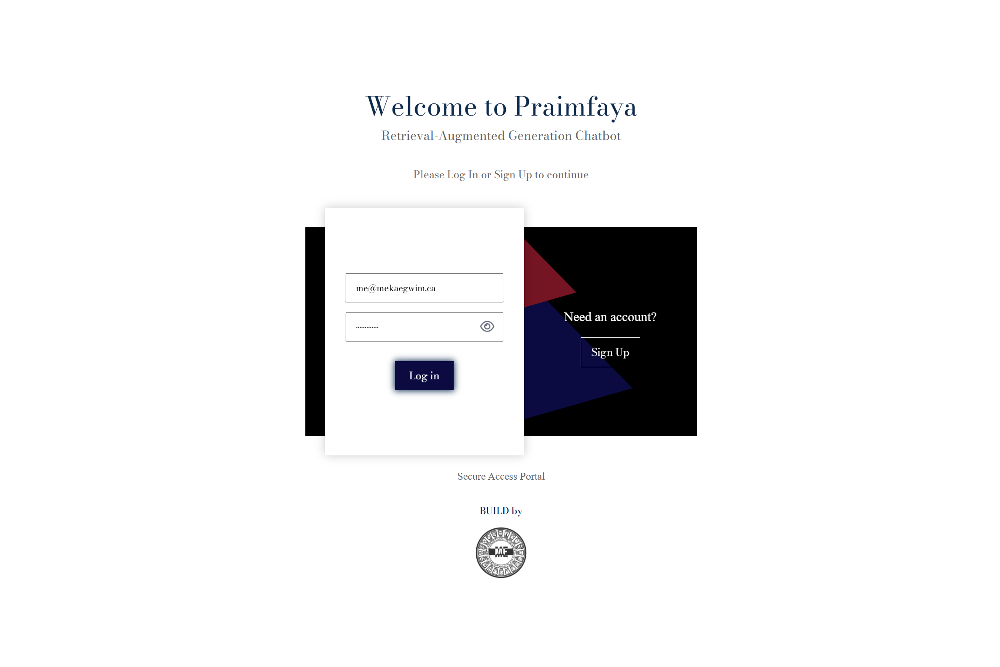
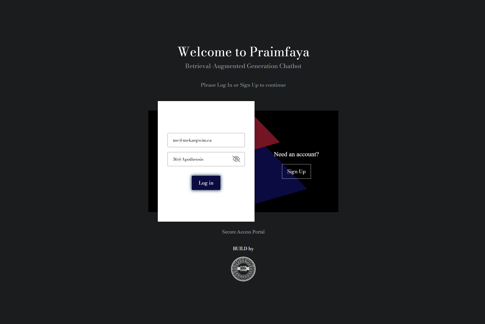

# Praimfaya /praɪmˈfaɪə/
## AWS Amplify AI Kit Web Application
 

### Synopsis Overview
<p align="justify">
RAG (Retrieval-Augmented Generation) chatbot interface web application leveraging AWS Amplify and Amazon Bedrock to connect foundation Large Language Models (LLMs) with private or external context and domain-specific data sources to render AI augmented subject matter expertise on any proffered contextual knowledge base.
</p>

### Showcase URL
<a href="https://prometheus.d3ewnfblgo4740.amplifyapp.com/" target="_blank">Praimfaya :: RAG (Retrieval Augmented Generation) Chatbot</a>


### UI Screenshots
#### Light & Dark Mode

<br/>&nbsp;


### System Design & Architecture
<ol>
<li>
<p align="justify">
<strong>TypeScript React Frontend:</strong> Component-driven Single Page Application (SPA) engineered with React and strict TypeScript. Dynamic state management via Redux & React Context and an intuitive chat interface to handle real-time user inputs and render streaming AI responses.
</p>
</li>
<li>
<p align="justify">
<strong>AWS AppSync & Amazon S3 Storage Backend:</strong> Serverless orchestration and Infrastructure as Code (IaC) layer. Securely bridges the frontend user client with convenience methods and functions for interfacing with AWS backend microservices, environment configurations and managing API routing (REST/GraphQL) to provide a seamless integration with cloud-native services.
</p>
</li>
<li>
<p align="justify">
<strong>Amazon Cognito User Identity Pool, Authentication and Authorization:</strong> User identity, authentication and authorization managed with AWS Cognito & OAuth 2.0. Customer Identity and Access Management (CIAM) cloud-based service for authenticating and authorizing users.
</p>
</li>
<li>
<p align="justify">
<strong>User Subscriptions:</strong> User subscriptions facilitated by Stripe API in tandem with Stripe Webhooks.
</p>
</li>
<li>
<p align="justify">
<strong>Amazon Bedrock LLM Integration:</strong> Core AI engine providing secure, serverless API access to top-tier foundation models (e.g., Anthropic Claude, Amazon Titan, Meta Llama). Facilitates RAG pipeline by ingesting vectorized, domain-specific data and assembling highly contextualized prompts to proffer accurate, hallucination-resistant chatbot outputs.
</p>
</li>
</ol>

### Tool Stack

#### AWS Infrastructure | Front End, Authentication & API 


#### Type Safety & Data Query


#### Build Utilities


#### CI/CD Automation


### AWS Amplify Aide-Mémoire 📖

#### Install AWS Amplify 
<p align="justify">
Install AWS Amplify library in extant project.
</p>

```bash
npm install aws-amplify
```
#### Install Create Amplify
<p align="justify">
Install <code>create-amplify</code> in extant project to scaffold and initialize new Amplify project.
</p>

```bash
npm install create-amplify
```

#### Create AWS Amplify Project 

<p align="justify">
Add AWS Amplify to existing Vite base project.
</p>

```bash
npm create amplify@latest
```

#### Mount AWS Amplify into App 

<p align="justify">
Mount AWS Amplify to the application instance with the auto-generated <code>amplify_outputs.json</code> in project root</p>

```typescript
import { Amplify } from 'aws-amplify';
import amplifyOutputs from '../amplify_outputs.json';
```

#### Run AWS Amplify Sandbox 

<p align="justify">
Run extant AWS Amplify project in developer sandbox.
</p>

```bash
npx ampx sandbox
```

#### Delete AWS Amplify Sandbox 

<p align="justify">
Delete an existing AWS Amplify sandbox and resources.
</p>

```bash
npx ampx sandbox delete
```

#### Manually generate Amplify Outputs .json 

<p align="justify">
Generates the <code>amplify_outputs.json</code> for a specified deployed branch.
</p>

```bash
npx ampx generate outputs --branch main
```

#### Amplify CLI Commands

<p align="justify">
Run help command for a list of available Amplify CLI commands.
</p>

```bash
npx ampx help
```

#### Cognito User Pool: Force Password Change

<p align="justify">
To force a password change for a Cognito user via AWS CLI, use the <code>admin-set-user-password</code> command with the <code>--permanent</code> or <code>--password-reset-required</code> flag.

<code>--password-reset-required</code> flag sets a temporary password and forces a <code>NEW_PASSWORD_REQUIRED</code> challenge upon the next sign-in.

</p>

```shell
aws cognito-idp admin-set-user-password \
    --user-pool-id <YOUR_USER_POOL_ID> \
    --username <YOUR_USERNAME> \
    --password <TEMPORARY_PASSWORD> \
    --permanent
```
```shell
aws cognito-idp admin-set-user-password \
    --user-pool-id <YOUR_USER_POOL_ID> \
    --username <YOUR_USERNAME> \
    --password <TEMPORARY_PASSWORD> \
    --password-reset-required
```

#### AWS Amplify: Using extant Cognito Resources

<p align="justify">
Manually configure AWS Amplify application instance to use an extant User Pool and Identity Pool.
</p>

```typescript
Amplify.configure({
  Auth: {
    Cognito: {
      userPoolId: 'XX-XXXX-X_abcd1234',
      userPoolClientId: 'a1b2c3d4e5f6g7h8i9j0k1l2m3',
      identityPoolId: 'XX-XXXX-X:xxxxxxxx-xxxx-xxxx-xxxx-xxxxxxxxxxxx'
    }
  }
});
```

#### AWS Amplify Auth: Convenience Methods
<p align="justify">
Amplify Auth convenience <a href="https://docs.amplify.aws/react/frontend/auth/manage-user-sessions/">methods</a> for seamlessly integrating user authentication via Amazon Cognito.
</p>

##### getCurrentUser()
<p align="justify">
Returns a lightweight credential object comprised of extant <code>username</code>, <code>userId</code> and a <code>signInDetails</code> object containing details about how the extant user signed: <code>loginId</code> & <code>authFlowType</code>.

<code>getCurrentUser()</code> reads from the browser's local storage/memory and doesn't make a fresh HTTP request to AWS network.
</p>

```typescript
import { getCurrentUser } from 'aws-amplify/auth';

const { userId, username, signInDetails } = await getCurrentUser();
```

##### fetchUserAttributes()
<p align="justify">
Returns extant user attributes such as <code>name</code>, <code>email</code>, <code>phone_number</code>.
</p>

```typescript
import { fetchUserAttributes } from 'aws-amplify/auth';

const attributes = await fetchUserAttributes();
const phone = attributes.phone_number;
console.log(phone);
```

##### fetchAuthSession()
<p align="justify">
Returns a comprehensive object that comprises of extant user authentication details such as <code>accessToken</code>, <code>idToken</code>, <code>refreshToken</code>, <code>userSub</code>, <code>credentials</code>

<ul>
<li>
<code>tokens</code>: Amazon Contains <code>accessToken</code>, <code>idToken</code> and <code>refreshToken</code>
</li>
<li>
<code>userSub</code>: Cognito unique identifier for the extant user.
</li>
<li>
<code>credentials</code>: Temporary AWS IAM Identity Pool credentials, if identity pools are configured.
</li>
</ul>

NOTE: If <code>fetchAuthSession()</code> is called and the extant user credentials have expired, Amplify will automatically utilize the <code>refreshToken</code> behind the scenes to refresh and update the active <code>accessToken</code>.
</p>

```typescript
import { fetchAuthSession } from 'aws-amplify/auth';

const session = await fetchAuthSession();

// Enable forceRefresh to always bypass cache and fetch new token.
const session = await fetchAuthSession({ forceRefresh: true });

// JWT Tokens
const accessToken = session.tokens?.accessToken?.toString();
const idToken = session.tokens?.idToken?.toString();

// Inspect Token Payload
const userGroups = session.tokens?.accessToken?.payload['cognito:groups'];
const email = session.tokens?.idToken?.payload?.email;

// Get AWS Identity Pool Credentials (if configured)
const accessKeyId = session.credentials?.accessKeyId;
const secretAccessKey = session.credentials?.secretAccessKey;
const sessionToken = session.credentials?.sessionToken;
const identityId = session.identityId;
```


#### AWS Amplify GitHub Actions Workflow

<p align="justify">
Overrides AWS Amplify's built-in CI/CD; multi-job GitHub actions workflow undertakes testing, <code>amplify_outputs.json</code> caching and frontend <code>dist</code> & backend <code>.amplify</code> build processes.

Web application build artifacts deployed to Amplify Hosting via AWS CLI.

<strong>Prerequisite</strong>: Log in to AWS Amplify Console and create `prometheus` hosting environment for specified <code>AMPLIFY_APP_ID</code></p>

```yaml
name: AWS Amplify (Praimfaya Deploy) 

on:
  push:
    branches:
      - prometheus

concurrency: 
  group: ${{ github.workflow }}-production
  cancel-in-progress: true

jobs:
  test:
    name: Run Praimfaya Tests
    runs-on: ubuntu-latest
    steps:
      - name: Checkout Praimfaya repository
        uses: actions/checkout@v5

      - name: Setup Node.js
        uses: actions/setup-node@v5
        with:
          node-version: 20 
          cache: 'npm'

      - name: Install Praimfaya dependencies
        run: npm ci

      - name: Run Linter
        run: npm run lint

      - name: Run Jest Tests
        run: npm run test

  deploy-backend:
    name: Deploy Praimfaya Amplify Backend
    needs: test 
    runs-on: ubuntu-latest
    steps:
      - name: Checkout Praimfaya repository
        uses: actions/checkout@v5

      - name: Setup Node.js
        uses: actions/setup-node@v5
        with:
          node-version: 20 
          cache: 'npm'

      - name: Install Praimfaya dependencies
        run: npm ci

      - name: Configure AWS Credentials
        uses: aws-actions/configure-aws-credentials@v4
        with:
          aws-access-key-id: ${{ secrets.AWS_ACCESS_KEY_ID }}
          aws-secret-access-key: ${{ secrets.AWS_SECRET_ACCESS_KEY }}
          aws-region: ${{ secrets.AWS_REGION }}

      - name: Deploy Amplify Backend
        env:
          AMPLIFY_APP_ID: ${{ secrets.AMPLIFY_APP_ID }}
        run: |
          npx ampx pipeline-deploy --branch prometheus --app-id $AMPLIFY_APP_ID

      - name: Upload amplify_outputs.json artifact
        uses: actions/upload-artifact@v4
        with:
          name: amplify-outputs
          path: amplify_outputs.json
          retention-days: 1

  deploy-frontend:
    name: Build & Deploy Frontend
    needs: deploy-backend 
    runs-on: ubuntu-latest
    steps:
      - name: Checkout Praimfaya repository
        uses: actions/checkout@v5

      - name: Setup Node.js
        uses: actions/setup-node@v5
        with:
          node-version: 20 
          cache: 'npm'

      - name: Install dependencies
        run: npm ci

      - name: Download amplify_outputs.json artifact
        uses: actions/download-artifact@v4
        with:
          name: amplify-outputs
          path: . 

      - name: Build Vite Application
        run: npm run build
        env:
          VITE_API_URL: ${{ secrets.VITE_API_URL }}

      - name: Zip Vite build artifact
        run: |
          cd dist
          zip -r ../deploy.zip .
          cd ..

      - name: Configure AWS Credentials
        uses: aws-actions/configure-aws-credentials@v4
        with:
          aws-access-key-id: ${{ secrets.AWS_ACCESS_KEY_ID }}
          aws-secret-access-key: ${{ secrets.AWS_SECRET_ACCESS_KEY }}
          aws-region: ${{ secrets.AWS_REGION }}

      - name: Deploy Frontend to AWS Amplify
        env:
          AMPLIFY_APP_ID: ${{ secrets.AMPLIFY_APP_ID }}
        run: |
          DEPLOYMENT_PAYLOAD=$(aws amplify create-deployment --app-id $AMPLIFY_APP_ID --branch-name prometheus)
          
          JOB_ID=$(echo $DEPLOYMENT_PAYLOAD | jq -r '.jobId')
          UPLOAD_URL=$(echo $DEPLOYMENT_PAYLOAD | jq -r '.zipUploadUrl')

          curl -v -T deploy.zip "$UPLOAD_URL"

          aws amplify start-deployment --app-id $AMPLIFY_APP_ID --branch-name prometheus --job-id $JOB_ID
```

#### AWS Amplify CI/CD Automation IAM Policy
```json
{
    "Version": "2012-10-17",
    "Statement": [
        {
            "Sid": "AmplifyHostingAndDeployment",
            "Effect": "Allow",
            "Action": [
                "amplify:CreateDeployment",
                "amplify:StartDeployment",
                "amplify:GetApp",
                "amplify:GetBranch",
                "amplify:GetJob",
                "amplify:UpdateApp",
                "amplify:UpdateBranch"
            ],
            "Resource": "*"
        },
        {
            "Sid": "CloudFormationStackManagement",
            "Effect": "Allow",
            "Action": [
                "cloudformation:CreateStack",
                "cloudformation:UpdateStack",
                "cloudformation:DeleteStack",
                "cloudformation:DescribeStacks",
                "cloudformation:DescribeStackEvents",
                "cloudformation:DescribeStackResources",
                "cloudformation:GetTemplate",
                "cloudformation:ValidateTemplate"
            ],
            "Resource": "*"
        },
        {
            "Sid": "S3DeploymentBuckets",
            "Effect": "Allow",
            "Action": [
                "s3:CreateBucket",
                "s3:PutObject",
                "s3:GetObject",
                "s3:DeleteObject",
                "s3:ListBucket",
                "s3:DeleteBucket",
                "s3:PutBucketPolicy",
                "s3:DeleteBucketPolicy"
            ],
            "Resource": "*"
        },
        {
            "Sid": "IAMRoleManagementForBackendResources",
            "Effect": "Allow",
            "Action": [
                "iam:PassRole",
                "iam:CreateRole",
                "iam:PutRolePolicy",
                "iam:DeleteRolePolicy",
                "iam:DeleteRole",
                "iam:AttachRolePolicy",
                "iam:DetachRolePolicy",
                "iam:GetRole",
                "iam:GetRolePolicy"
            ],
            "Resource": "*"
        },
        {
            "Sid": "SystemsManagerForSecretsAndConfig",
            "Effect": "Allow",
            "Action": [
                "ssm:GetParameter",
                "ssm:GetParameters",
                "ssm:GetParametersByPath",
                "ssm:PutParameter",
                "ssm:DeleteParameter"
            ],
            "Resource": "*"
        },
        {
            "Sid": "BackendInfrastructureProvisioning",
            "Effect": "Allow",
            "Action": [
                "appsync:*",
                "dynamodb:*",
                "cognito-idp:*",
                "cognito-identity:*",
                "lambda:*"
            ],
            "Resource": "*"
        }
    ]
}
```

#### AWS Amplify Hosting (amplify.yml) Build Dependency Fix
```yaml
version: 1
backend:
  phases:
    build:
      commands:
        - npm install --cache .npm --prefer-offline
        - npx ampx pipeline-deploy --branch $AWS_BRANCH --app-id $AWS_APP_ID
frontend:
  phases:
    build:
      commands:
        - npm run build
  artifacts:
    baseDirectory: dist
    files:
      - '**/*'
  cache:
    paths:
      - .npm/**/*
```

#### Resource References
<ul>
<li><a href="https://docs.amplify.aws/react/start/quickstart/" target="_blank">Amplify React</a></li>
<li><a href="https://docs.amplify.aws/react-native/start/quickstart/" target="_blank">Amplify React Native</a></li>
<li><a href="https://docs.amplify.aws/nextjs/start/quickstart/" target="_blank">Amplify Next.js</a></li>
<li><a href="https://docs.amplify.aws/angular/start/quickstart/" target="_blank">Amplify Angular</a></li>
<li><a href="https://docs.amplify.aws/javascript/start/quickstart/" target="_blank">Amplify JavaScript</a></li>
<li><a href="https://docs.amplify.aws/android/start/quickstart/" target="_blank">Amplify Kotlin (Android)</a></li>
<li><a href="https://docs.amplify.aws/swift/start/quickstart/" target="_blank">Amplify Swift (iOS)</a></li>
<li><a href="https://docs.amplify.aws/flutter/start/quickstart/" target="_blank">Amplify Flutter</a></li>
<li><a href="https://docs.amplify.aws/react/reference/amplify_outputs/" target="_blank">amplify_outputs.json</a></li>
<li><a href="https://docs.aws.amazon.com/cognito/latest/developerguide/what-is-amazon-cognito.html" target="_blank">AWS Cognito</a></li>
<li><a href="https://docs.aws.amazon.com/cdk/" target="_blank">AWS CDK</a></li>
<li><a href="https://www.serverless.com/guides/aws-appsync" target="_blank">AWS AppSync</a></li>
<li><a href="https://docs.aws.amazon.com/bedrock/latest/userguide/what-is-bedrock.html" target="_blank">Amazon Bedrock</a></li>
<li><a href="https://docs.aws.amazon.com/cloudformation/" target="_blank">AWS CloudFormation</a></li>
<ul>

